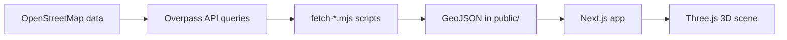

# yeoksam-taxi

`yeoksam-taxi` is an OSM + Three.js 3D digital-twin companion for the `A-Eye` capstone.

It expands the simplified `Yeoksam 3x3 SUMO baseline` from `A-Eye` into a spatial scene built from 9 real administrative dongs around Gangnam Station and the Gangnam core. Roads, buildings, non-road surfaces, transit landmarks, and signal anchors come from OpenStreetMap through Overpass and are rendered directly with Three.js.

This repo is meant to support `Module 1` style digital-twin presentation and spatial validation. It is not the main dispatch-evaluation baseline itself, and it should not claim full Gangnam or full Seoul traffic replication.

This project does not use Google Maps Platform for map rendering. The only Google-related import in the app is `next/font/google`, which is used for fonts.

## Stack

- `Next.js` for the app shell
- `Three.js` for 3D rendering
- `OpenStreetMap + Overpass API` for roads and buildings
- `osmtogeojson` for converting OSM data into GeoJSON

## Scripts

```bash
npm run launch
npm run asset:update
npm run dev
npm run build
npm run lint
npm run fetch:buildings
npm run fetch:non-road
npm run fetch:roads
npm run fetch:road-network
npm run fetch:map
```

## Local Development

```bash
npm install
npm run launch
```

If you want the interactive menu:

- `npm run launch` explains the main `npm run` options and then lets you choose:
  - `dev` for HMR-driven local work
  - `start` for a production server
  - `build`, `lint`, or `asset:update` for non-server tasks
- When you choose `dev` or `start`, the launcher then asks whether to:
  - open immediately on the default `3000`
  - open on a custom port such as `8000` for VDI
- The launcher binds Next.js to `0.0.0.0` by default so `localhost` still works on the current machine.
- It also prints a detected external access URL when the host has a routable IP, which is useful on this VDI when port `8000` is exposed.
- After you pick the port, the launcher prints both the local and external access URLs before handing off to Next.js.

If you already know what you want, you can still run the direct commands:

```bash
npm run dev
npm run dev -- --hostname 0.0.0.0 --port 8000
npm run start -- --hostname 0.0.0.0 --port 8000
```

Open `http://localhost:3000`.

## FPS Modes

- `Auto` snaps the measured `requestAnimationFrame` cadence to a common display-refresh band.
- Below `100Hz`, `Auto` targets full refresh such as `60`, `72`, `75`, or `90 FPS`.
- On `100Hz+` displays, `Auto` targets half-refresh such as `60` on `120Hz`, `72` on `144Hz`, and `83` on `165Hz`.
- `60 FPS` forces a visible 60 FPS target.
- `Unlimited` removes the visible render cap.

## Road Network Layer

- The simulator now stores a separate prebuilt road graph in `public/road-network.json` for shortest-path style routing and road-network inspection.
- You can now toggle a separate road-network overlay that shows graph edges as thin lines and graph nodes as points on top of the rendered streets.
- This layer is meant for inspection and future routing work, similar to a lightweight road-network debug view rather than a replacement for the main road rendering.
- `npm run fetch:roads` regenerates both `public/roads.geojson` and the lighter `public/road-network.json` asset.

## Simulation Density

- The sidebar now includes live density sliders for both taxis and general traffic.
- Changing either slider rebuilds only the vehicle layer with the new counts, so taxi targets, follow view, and aggregate stats stay aligned without resetting the full map scene.
- Density changes are deferred slightly while dragging to avoid thrashing the vehicle layer on every intermediate slider tick.

## Local Scenario Presets

- The main sidebar now includes four local-only scenario presets for quick `A-Eye Module 1` demos:
  - `기본 검증`
  - `강남역 피크`
  - `비 오는 저녁`
  - `심야 완화`
- Each preset applies a bundled combination of time, weather, taxi count, traffic count, and a nearby subway-hub camera focus.
- This keeps the viewer easy to present and compare even when no external demand or weather feed is connected.
- A small `Local Check` panel also shows scene-internal proxy metrics such as waiting share, trip close share, street load, and a coarse flow-state label.
- These are intentionally lightweight validation cues, not operational KPIs.

## Project Docs

- `CHANGELOG.md`: dated update history
- `docs/added-taxi-call-review.md`: current `added-taxi-call` vs `main` comparison
- `docs/dispatch-road-network-review.md`: current OSM road graph suitability for dispatch and pickup/dropoff routing
- `docs/a-eye-module1-alignment.md`: how this 9-dong OSM viewer maps back to the active `A-Eye` scope

## Data

The simulator uses:

- `public/dongs.geojson`
- `public/buildings.geojson`
- `public/non-road.geojson`
- `public/roads.geojson`
- `public/transit.geojson`
- `public/road-network.json`

These files can be regenerated from OpenStreetMap with:

```bash
npm run asset:update
```

- `npm run asset:update` is the recommended asset refresh command.
- `npm run fetch:map` remains as a compatibility alias to the same updater.
- Asset refresh can take a few minutes because Overpass mirrors may rate-limit and retry.

## How The Map Is Built

This project does not stream a live 3D city map from a map provider at runtime.

Instead, it uses a small offline pipeline:

1. `fetch-dongs.mjs` fetches the 9 target administrative dongs from OpenStreetMap administrative relations through Overpass.
2. `fetch-buildings.mjs`, `fetch-non-road.mjs`, `fetch-roads.mjs`, and `fetch-transit.mjs` query Overpass again, but only for geometry that falls inside those dong boundaries.
3. The raw OSM responses are converted into simplified GeoJSON with `osmtogeojson`.
4. `fetch-non-road.mjs` stores OSM polygon areas such as parks, plazas, parking lots, water, and campus-like surfaces in `public/non-road.geojson`.
5. `fetch-roads.mjs` also derives a separate `public/road-network.json` graph asset from the road geometry.
6. The processed results are saved into `public/*.geojson` plus `public/road-network.json`.
7. At app runtime, the browser loads those local assets and Three.js turns them into roads, non-road surfaces, buildings, transit landmarks, and the simulation scene while the routing layer reads the lighter graph asset directly.



## Real-Time vs Snapshot

- The 3D geometry is `not` fetched live every time from OpenStreetMap while the scene is running.
- What the viewer actually reads is the local snapshot in:
  - `public/dongs.geojson`
  - `public/buildings.geojson`
  - `public/non-road.geojson`
  - `public/roads.geojson`
  - `public/transit.geojson`
- For routing and graph inspection, it also reads:
  - `public/road-network.json`
- If OSM data changes, you need to run `npm run asset:update` again to regenerate the local assets.
- Weather, taxi movement, routing, signal behavior, and pickup/dropoff events are app-side simulation layers on top of that saved OSM geometry.

## Notes

- In `A-Eye`, the current active baseline is still the simplified `Yeoksam 3x3 SUMO` path for before/after dispatch validation.
- This repo complements that baseline by giving the project a richer `Module 1` spatial layer built from real OSM geometry across the Gangnam Station micro-area.
- The current prototype uses 9 administrative dongs in Gangnam-gu: `역삼1동`, `역삼2동`, `논현1동`, `논현2동`, `삼성1동`, `삼성2동`, `신사동`, `청담동`, `대치4동`.
- The 9-dong choice is intentional: it keeps the project inside the same Gangnam Station micro-area story while making the map explainable in terms of real administrative geography instead of abstract 3x3 cells.
- Dong boundaries are fetched from OpenStreetMap administrative relations through Overpass, but boundary rendering is currently disabled while a clearer visualization approach is being redesigned.
- Roads, buildings, and transit landmarks come from OSM geometry, but some visual properties are simplified for readability.
- Building heights are partially inferred from `height`, `building:levels`, or fallback heuristics when OSM is incomplete.
- OSM is used here as the geometry backbone for roads, curbside context, signal anchors, and pickup/dropoff reasoning. It is the right prototype dataset for this scope, but it is not a dispatch-grade legal road-operations source by itself.
- Taxi demand, signals, pedestrians, routing behavior, and vehicle logic are simulated inside the app on top of OSM-derived geometry.
- The current branch also includes weather/time presets, taxi roof-sign states, pickup/dropoff emphasis, and click-to-enter `Taxi View`.
- This is reliable enough for a spatial prototype and demo, but not a substitute for official real-time transport or cadastral data.

## A-Eye Alignment

- `A-Eye` currently evaluates dispatch on a simplified `Yeoksam 3x3` SUMO baseline.
- `yeoksam-taxi` keeps the same Gangnam Station micro-area intent, but expresses it through `9 real dongs + OSM roads`.
- The practical interpretation is:
  - use the `3x3` layer for compact dispatch comparison when needed
  - use the `9-dong OSM` layer for digital-twin presentation, road/signal realism, and future dong-level data overlays
- This repo should therefore be described as a `Module 1 spatial companion` to the active `A-Eye` baseline, not as a competing second baseline.

## Current Branch Snapshot

The active demo branch is `added-taxi-call`.

Compared with `main`, it currently adds:

- 9-dong OSM scene coverage across the Gangnam core demo area
- weather and time-of-day presets that mainly affect the sky/background
- transit landmarks such as bus stops and subway structures
- clickable taxi chase view with `Esc` to exit
- clearer pickup and dropoff badges plus roof-sign occupancy cues

Before merging to `main`, keep a small comparison set under `docs/screenshots/`:

- `main-baseline-overview.png`
- `added-taxi-call-weather-overview.png`
- `added-taxi-call-taxi-view.png`

## Screenshot Comparison

### Main Baseline


### Current Branch: Weather Overview


### Current Branch: Taxi View


## Short Roadmap

- Replace placeholder-looking signal visuals and implement more realistic signal logic.
- Reduce or resolve deadlock behavior at busy intersections.
- Make density changes hot-swappable without rebuilding the full scene.
- Revisit district visualization with a road-aligned ground overlay instead of the current disabled boundary view.
- Add hourly CSV-based weather, taxi-demand, and traffic data for the 9 selected dongs before attempting real-time ingestion.
- Define a merged dong-level time-series format for later forecasting/model experiments.
