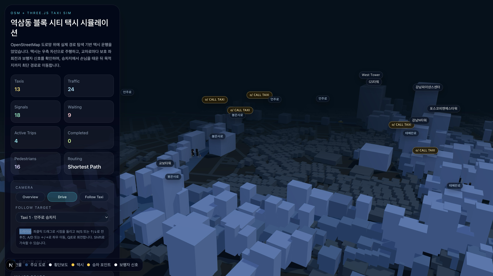
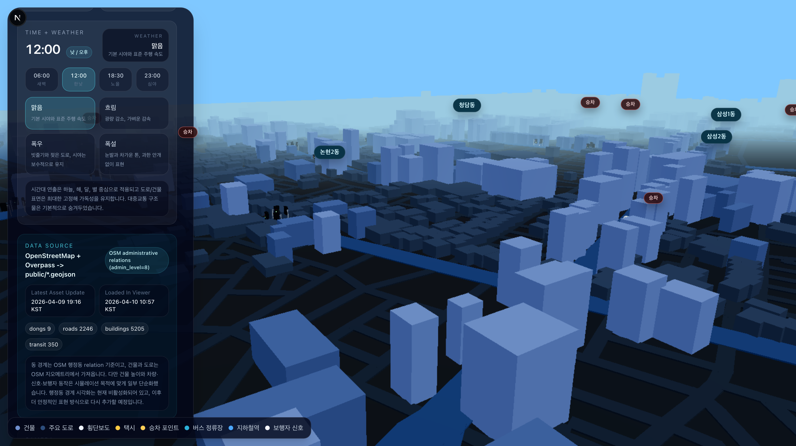
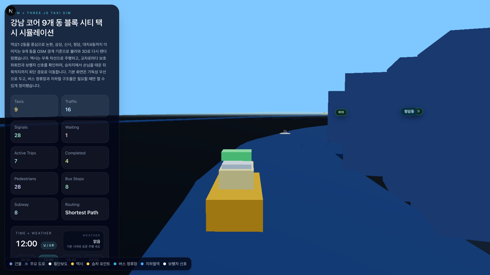

# yeoksam-taxi

`yeoksam-taxi` is a Next.js and Three.js 3D map prototype focused on taxi movement around Yeoksam, Seoul.

It uses OpenStreetMap road and building data fetched through Overpass, converts that data into GeoJSON, and renders the scene directly with Three.js.

This project does not use Google Maps Platform for map rendering. The only Google-related import in the app is `next/font/google`, which is used for fonts.

## Stack

- `Next.js` for the app shell
- `Three.js` for 3D rendering
- `OpenStreetMap + Overpass API` for roads and buildings
- `osmtogeojson` for converting OSM data into GeoJSON

## Scripts

```bash
npm run dev
npm run build
npm run lint
npm run fetch:buildings
npm run fetch:roads
npm run fetch:map
```

## Local Development

```bash
npm install
npm run dev
```

Open `http://localhost:3000`.

## Project Docs

- `CHANGELOG.md`: dated update history
- `docs/added-taxi-call-review.md`: current `added-taxi-call` vs `main` comparison

## Data

The simulator uses:

- `public/dongs.geojson`
- `public/buildings.geojson`
- `public/roads.geojson`
- `public/transit.geojson`

These files can be regenerated from OpenStreetMap with:

```bash
npm run fetch:map
```

## Notes

- The current prototype uses 9 administrative dongs in Gangnam-gu: `역삼1동`, `역삼2동`, `논현1동`, `논현2동`, `삼성1동`, `삼성2동`, `신사동`, `청담동`, `대치4동`.
- Dong boundaries are fetched from OpenStreetMap administrative relations through Overpass, but boundary rendering is currently disabled while a clearer visualization approach is being redesigned.
- Roads, buildings, and transit landmarks come from OSM geometry, but some visual properties are simplified for readability.
- Building heights are partially inferred from `height`, `building:levels`, or fallback heuristics when OSM is incomplete.
- Taxi demand, signals, pedestrians, routing behavior, and vehicle logic are simulated inside the app on top of OSM-derived geometry.
- The current branch also includes weather/time presets, taxi roof-sign states, pickup/dropoff emphasis, and click-to-enter `Taxi View`.
- This is reliable enough for a spatial prototype and demo, but not a substitute for official real-time transport or cadastral data.

## Current Branch Snapshot

The active demo branch is `added-taxi-call`.

Compared with `main`, it currently adds:

- 9-dong OSM scene coverage across the Gangnam core demo area
- weather and time-of-day presets that mainly affect the sky/background
- transit landmarks such as bus stops and subway structures
- clickable taxi chase view with `Esc` to exit
- clearer pickup and dropoff badges plus roof-sign occupancy cues

Before merging to `main`, keep a small comparison set under `docs/screenshots/`:

- `main-baseline-overview.png`
- `added-taxi-call-weather-overview.png`
- `added-taxi-call-taxi-view.png`

## Screenshot Comparison

### Main Baseline



### Current Branch: Weather Overview



### Current Branch: Taxi View



## Short Roadmap

- Add better UX controls such as a taxi-count slider.
- Replace placeholder-looking signal visuals and implement more realistic signal logic.
- Reduce or resolve deadlock behavior at busy intersections.
- Revisit district visualization with a road-aligned ground overlay instead of the current disabled boundary view.
- Add hourly CSV-based weather, taxi-demand, and traffic data for the 9 selected dongs before attempting real-time ingestion.
- Define a merged dong-level time-series format for later forecasting/model experiments.
