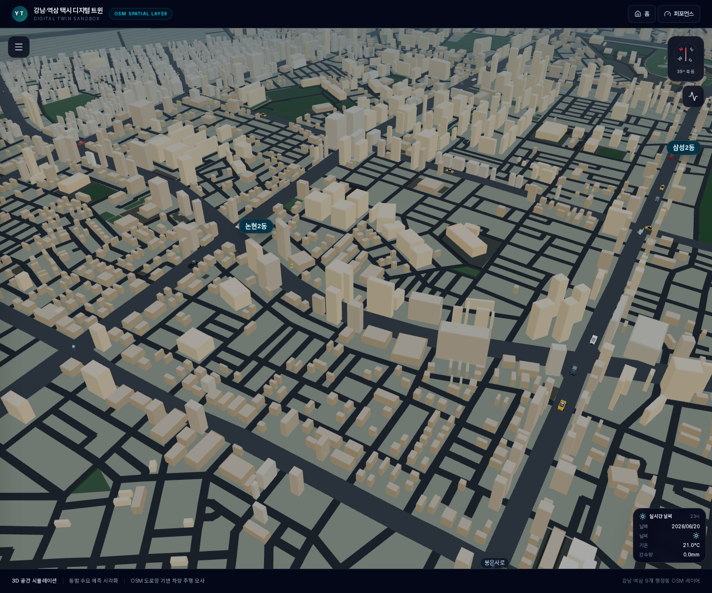
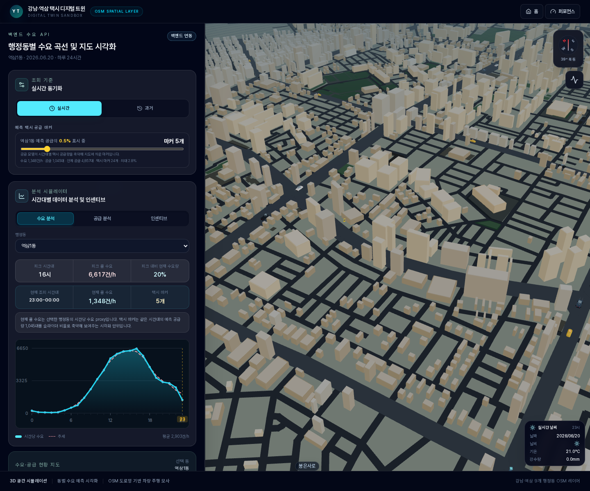
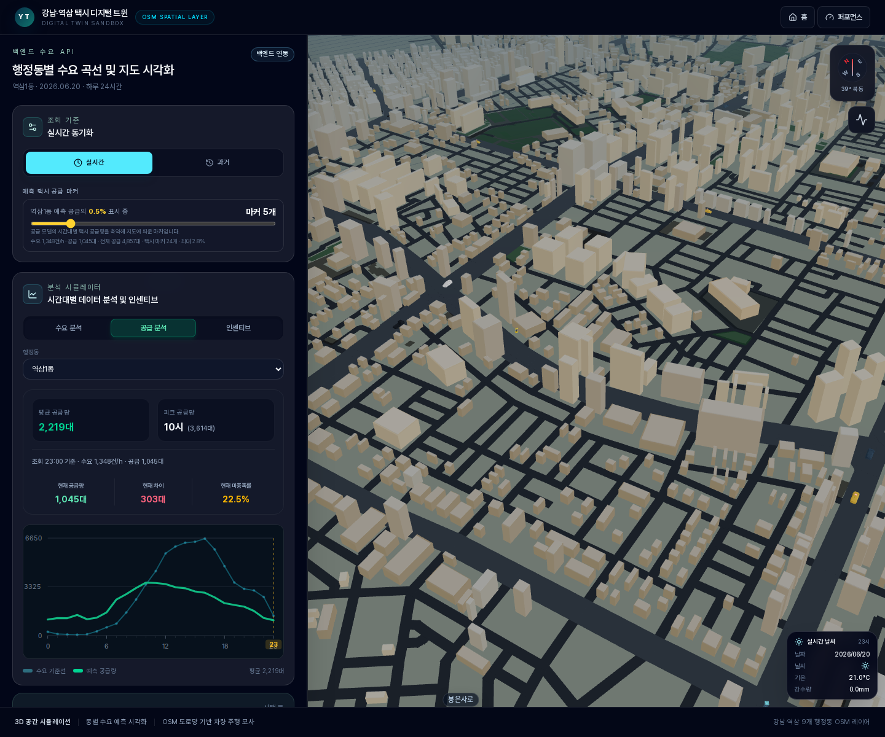
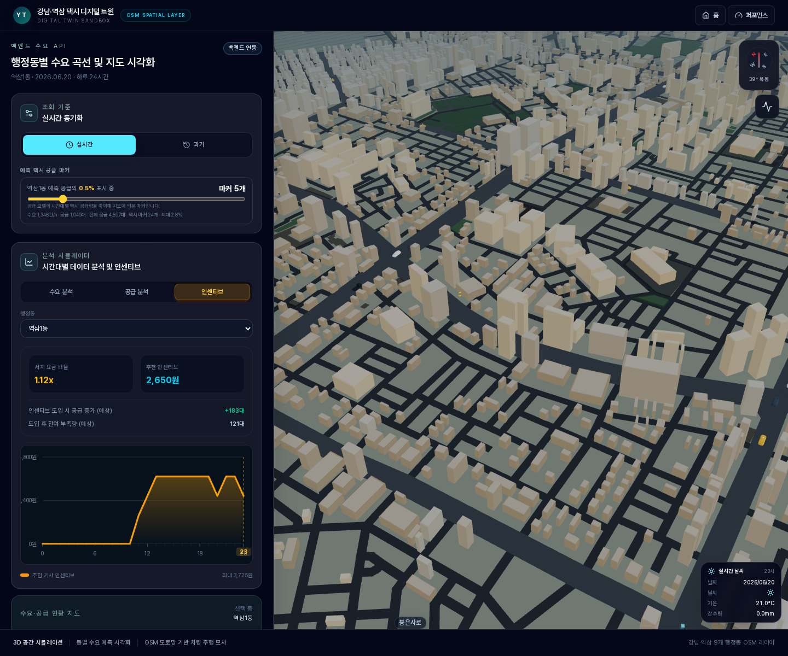
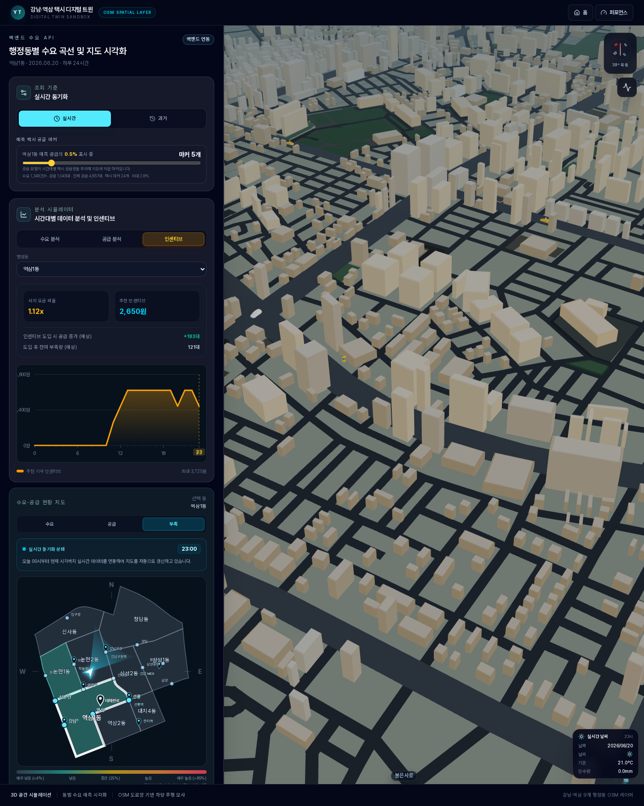
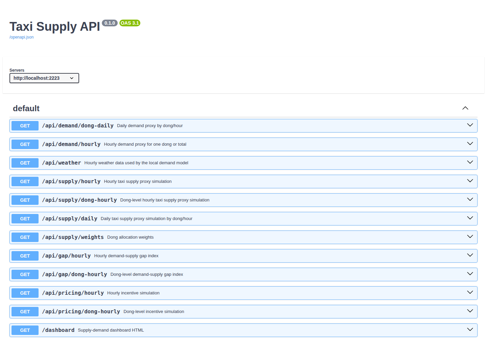
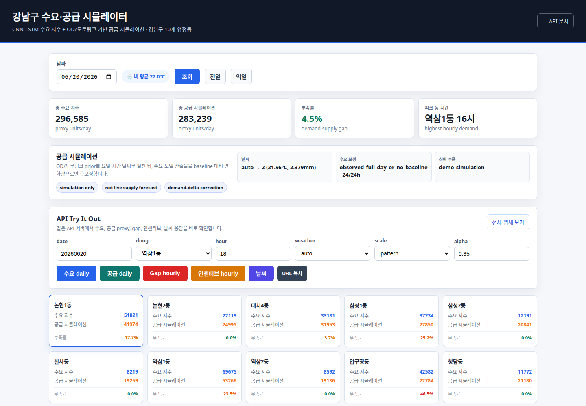

# 강남·역삼 택시 수요-공급 디지털 트윈

강남·역삼권의 택시 수요-공급 불균형을 예측하고, 3D 도시 지도 위에서 시간대별 수요·공급·부족 구간·인센티브 정책을 함께 확인하는 웹 기반 디지털 트윈 프로젝트입니다.

이 저장소는 프론트엔드 시연 화면과 프로젝트 문서를 중심으로 정리되어 있습니다. 백엔드 모델과 API 산출물은 별도 실행 산출물로 관리하며, README에는 평가자가 프로젝트 의도와 구현 범위를 빠르게 이해할 수 있도록 핵심 기능을 요약했습니다.

## 한눈에 보기

| 구분 | 내용 |
| --- | --- |
| 문제 | 강남·역삼권의 시간대별 택시 수요 집중과 공급 불균형 |
| 접근 | CNN-LSTM 수요 예측 + 도로링크 기반 공급 proxy + 3D 지도 시각화 |
| 화면 | 3D 도시 지도, 수요·공급 분석 패널, 인센티브 패널, 행정동 히트맵 |
| 프론트엔드 | Next.js 16, React 19, Three.js, React Three Fiber |
| API | demand, weather, supply, gap, pricing 프록시 연동 |
| 목적 | 실제 관제가 아니라 수요-공급 imbalance를 설명하는 분석·발표용 decision-support 시스템 |

## 핵심 질문

- 어느 행정동에서 어느 시간대에 택시 수요가 증가하는가?
- 예측 수요 대비 공급 proxy는 충분한가?
- 부족 구간을 지도, 차트, 행정동 히트맵으로 어떻게 설명할 수 있는가?
- 인센티브를 적용하면 공급 부족이 얼마나 완화되는 것으로 해석할 수 있는가?

## 주요 화면

### 3D 디지털 트윈



### 수요·공급 분석

| 수요 분석 | 공급 분석 |
| --- | --- |
|  |  |

### 인센티브 실험과 부족 구간

| 인센티브 추천 | 부족 구간 히트맵 |
| --- | --- |
|  |  |

### API 검증 화면

| Swagger UI | Supply 대시보드 |
| --- | --- |
|  |  |

## 구현 기능

### 1. OSM 기반 3D 도시 지도

OpenStreetMap 데이터를 전처리한 정적 자산으로 강남·역삼권 9개 행정동의 도로, 건물, 행정동 경계, 녹지, 대중교통 랜드마크, 교통신호, 택시 승강장을 렌더링합니다.

| 기능 | 설명 |
| --- | --- |
| 도로·건물 렌더링 | `roads.geojson`, `buildings.geojson` 기반 3D 공간 구성 |
| 행정동 경계 | 선택 동 hover/click 강조 및 히트맵 경계 표시 |
| 교통 레이어 | 지하철역, 버스 정류장, 교통신호, 택시 승강장 표시 |
| 성능 최적화 | Web Worker 파싱, 정적 청크 구성, frustum culling 적용 |

### 2. 시간·날씨 연동 시뮬레이션

사용자는 실시간 모드 또는 과거 조회 모드로 날짜와 시간을 선택할 수 있습니다. 선택된 시간은 수요·공급 차트, 행정동 히트맵, 3D 조명, 날씨 효과와 함께 동기화됩니다.

| 기능 | 설명 |
| --- | --- |
| 실시간 모드 | KST 기준 현재 날짜와 시간에 맞춰 조회 |
| 과거 조회 | 특정 날짜와 시간의 수요·공급 상태 확인 |
| 미래 시점 방지 | 현재보다 미래인 조회 시점을 자동 보정 |
| 날씨 효과 | 비·눈 파티클, 젖은 노면 표현, 날씨별 차량 속도 보정 |
| 천체 표현 | 시간대에 따른 태양, 달, 별, 조명 방향 변화 |

### 3. 수요 예측 시각화

프론트엔드는 수요를 직접 계산하지 않고 API가 내려주는 행정동·시간대별 수요 proxy를 그대로 시각화합니다.

| 기능 | 설명 |
| --- | --- |
| 24시간 수요 곡선 | 선택 행정동의 시간대별 수요 변화량 표시 |
| 피크 요약 | 피크 시간, 피크 수요, 현재 조회 시간 수요 요약 |
| 행정동 히트맵 | 9개 행정동의 상대 수요 밀도를 미니맵에 표시 |
| 선택 동 강조 | 3D 지도와 미니맵에서 선택 행정동 강조 |

### 4. 공급 proxy, gap, 인센티브 분석

공급값은 실제 택시 availability를 직접 관측한 값이 아니라, 도로링크 통계와 시간·요일·날씨 prior, 수요 변화량을 결합한 비교용 proxy입니다. 따라서 절대 실제 대수보다 행정동별 상대 순위와 시간대별 부족 패턴 해석에 초점을 둡니다.

| 기능 | 설명 |
| --- | --- |
| 공급 곡선 | 시간대별 공급 proxy를 차트로 표시 |
| 부족 구간 | 수요와 공급 proxy 차이를 gap으로 계산 |
| 부족 히트맵 | 행정동별 수요-공급 불균형을 색상으로 표현 |
| 인센티브 추천 | gap 기반 추천 요율과 예상 공급 증가량 표시 |

### 5. 택시 마커와 차량 흐름 표현

3D 지도 위 차량은 실제 GPS나 배차 결과가 아니라 수요·공급 proxy를 설명하기 위한 presentation-layer 마커입니다.

| 기능 | 설명 |
| --- | --- |
| 택시 수 조절 | 공급 proxy와 렌더링 한계를 고려해 지도 위 택시 마커 수 조절 |
| route pool 분산 | 택시 승강장과 주요 도로를 중심으로 차량 경로 분산 |
| 겹침 완화 | 시작 위치, 차간 거리, lateral offset으로 차량 뭉침 완화 |
| 교통 연출 | 신호 대기, 일반 차량, 날씨별 속도 변화로 도시 흐름 표현 |

### 6. API 프록시와 검증 화면

Next.js API route는 브라우저와 백엔드 사이의 중계 레이어로 동작합니다. 날짜 포맷 변환, 응답 캐시, in-flight request dedupe를 통해 반복 조회 지연을 줄입니다.

| Endpoint | 설명 |
| --- | --- |
| `GET /api/demand/dong-daily?date=YYYYMMDD` | 10개 동 시간대별 수요 예측 |
| `GET /api/demand/hourly?date=YYYYMMDD&dong=역삼1동` | 특정 동 24시간 수요 곡선 |
| `GET /api/weather?date=YYYYMMDD` | 24시간 날씨 피처 |
| `GET /api/supply/daily?date=YYYYMMDD` | 전체 동 24시간 공급 proxy |
| `GET /api/gap/dong-hourly?date=YYYYMMDD` | 동별·시간별 gap 행 |
| `GET /api/pricing/dong-hourly?date=YYYYMMDD` | 동별·시간별 인센티브 추천 |

## 모델 구조 요약

### 수요 모델

수요 모델은 24시간 시계열 피처를 입력으로 받는 CNN-LSTM 구조입니다.

```text
날씨, 교통량, 지하철 승하차, 시간/요일/공휴일, POI, 행정동 ID
  -> Conv1D + BatchNorm
  -> LSTM
  -> POI gating + 행정동 embedding + 예측 시점 context
  -> MLP + Softplus
  -> baseline 대비 demand rate
  -> predicted calls/hour proxy
```

예측 대상은 강남구 주요 10개 행정동입니다.

```text
논현1동, 논현2동, 대치4동, 삼성1동, 삼성2동,
신사동, 역삼1동, 역삼2동, 압구정동, 청담동
```

### 공급 모델

공급 proxy는 도로링크 통계 기반 prior를 행정동 단위로 집계하고, 요일·시간·날씨·수요 변화량을 반영해 계산합니다. 이 값은 실제 택시 대수의 확정값이 아니라 수요와 비교 가능한 분석 지표입니다.

## 시스템 흐름

```text
정적 공간 데이터
  -> Web Worker 파싱
  -> Three.js/R3F 3D 지도

사용자 날짜·시간·행정동 선택
  -> Next.js API proxy
  -> Demand / Weather / Supply / Gap / Pricing API
  -> 차트, 미니맵, 3D 마커 갱신
```

## 실행 방법

```bash
npm install
npm run dev -- --hostname 0.0.0.0 --port 8000
```

브라우저에서 `http://localhost:8000`을 엽니다.

```bash
npm run build
```

## 백엔드 산출물 관리

로컬의 `deploy/` 폴더는 API 코드, 모델 파일, CSV, 로그, PID, 가상환경 캐시가 섞인 실행 산출물이라 그대로 커밋하지 않습니다.

백엔드까지 제출하거나 재현 패키지를 만들어야 한다면 다음 기준으로 별도 정리하는 것이 안전합니다.

| 포함 | 제외 |
| --- | --- |
| FastAPI 소스 코드 | `.venv`, `__pycache__` |
| `requirements.txt` | `*.log`, `*.pid` |
| 최소 실행 스크립트 | 인증서, 서버 계정 정보 |
| 모델·데이터 파일 목록 | 개인 경로가 찍힌 실행 로그 |

대용량 모델과 데이터는 Git LFS 또는 별도 다운로드 링크로 관리하는 것을 권장합니다.

## 검증 기록

마지막 통합 검증 기준: `2026-06-12 21:20 KST`

| 항목 | 결과 |
| --- | --- |
| Python syntax compile | 통과 |
| `GET /docs` | 200 |
| `GET /openapi.json` | 200, 12 paths |
| `GET /api/supply/daily` | 200, 약 0.11s after warmup |
| `GET /api/pricing/dong-hourly` | 200, 약 0.11s after warmup |
| `GET /api/demand/dong-daily` | 200, 약 0.004s after warmup |
| Frontend proxy `/api/weather` | 200 |
| Frontend proxy `/api/supply` | 200 |
| Frontend proxy `/api/pricing` | 200 |
| Frontend proxy `/api/demand` | 200 |

## 구현 범위와 한계

| 포함 | 제외 |
| --- | --- |
| 공개·가공 데이터 기반 수요·공급 proxy 분석 | 실제 플랫폼 원천 호출 로그 |
| 3D 지도 기반 시각화와 발표용 시뮬레이션 | 실제 택시 GPS 실시간 관제 |
| 수요-공급 gap과 인센티브 정책 실험 지표 | 실제 배차·요금 정책 자동 결정 |
| 차량 밀도와 흐름의 시각적 표현 | lane-level microscopic traffic simulation |

외부 발표에서는 이 프로젝트를 “실시간 운영 최적화 시스템”보다 “수요·공급 imbalance를 설명하고 시뮬레이션하는 디지털 트윈 companion”으로 설명하는 것이 정확합니다.
